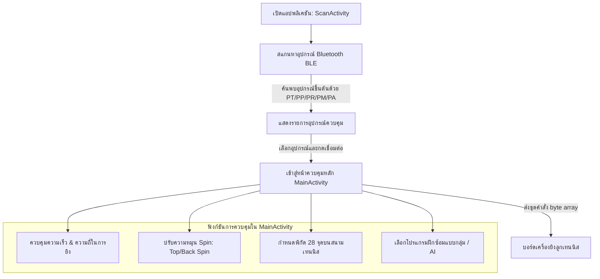

# 🎾 Pusun Tennis Machine Tablet Control App

แอปพลิเคชันระบบควบคุมเครื่องยิงลูกเทนนิสอัจฉริยะ **Pusun Tennis Machine** สำหรับอุปกรณ์แท็บเล็ต Android เชื่อมต่อและสั่งการตัวเครื่องผ่าน Bluetooth Low Energy (BLE) รองรับการตั้งค่าความเร็ว ความถี่ ทิศทาง มุมเงย รวมถึงโปรแกรมฝึกซ้อมระดับสูง (Drills) และการวางตำแหน่งลูกยิงแบบละเอียดบนสนาม

---

## 🏗️ โครงสร้างและการทำงานของแอปพลิเคชัน

แอปพลิเคชันนี้ออกแบบมาสำหรับการทำงานร่วมกับบอร์ดควบคุมของเครื่องยิงเทนนิสตระกูล **Pusun** (เช่น ซีรีส์ PT, PP, PR, PM, PA) โดยมี Flow การทำงานดังนี้:



---

## ✨ Features เด่นของแอปพลิเคชัน

### 1. ระบบควบคุมเครื่องยิงลูกเทนนิส (Machine Controls)
* **Speed & Frequency Adjustment**: ปรับระดับความเร็วและความถี่ในการปล่อยลูกยิงได้อย่างแม่นยำผ่าน Seekbar
* **Height & Rotation Control**: ปรับระดับความสูง/มุมเงย (Up/Down) และการหมุนตัวเครื่อง (Left/Right) ของหัวยิงลูก
* **Spin Control**: กำหนดปริมาณ Top Spin และ Back Spin ของลูกเทนนิส

### 2. การกำหนดตำแหน่งพิกัดแบบอิสระ (Custom Coordinates Grid)
* หน้าจอจำลองสนามเทนนิสพร้อม **Grid ยิง 28 จุดพิกัด** ช่วยให้ผู้ใช้เลือกกดตำแหน่งในสนามเพื่อให้เครื่องยิงลูกไปยังพิกัดนั้นได้โดยตรง
* รองรับโหมด **Self-Point Customization** เลือกจุดยิงหลายๆ จุดผสมกันเพื่อสร้างโปรแกรมซ้อมเฉพาะตัว

### 3. โปรแกรมฝึกซ้อมสำเร็จรูป (Preset Drills)
* **Group Drills & Cross**: โปรแกรมยิงลูกสลับทิศทางแบบกลุ่มสำหรับการฝึกซ้อมแบบเคลื่อนที่
* **Vary Drill Activities**: กิจกรรมจำลองการซ้อมรูปแบบต่างๆ แยกตามรุ่นของอุปกรณ์ (เช่น `VaryDrillActivityPPS`, `VaryDrillActivityPTP`, `VaryDrillActivityPS`)
* **AI Drill Mode (`AIDrillActivity`)**: โปรแกรมควบคุมอัจฉริยะที่ใช้ตรรกะ AI ในการจัดลำดับการเสิร์ฟและการยิงลูก

### 4. การจัดการหลายอุปกรณ์และหลายโมเดล (Multi-Variant Architecture)
* โครงสร้างของโปรเจกต์รองรับหน้าควบคุมหลักแยกตามโมเดลฮาร์ดแวร์ เช่น `MainActivityPM`, `MainActivityPMP`, `MainActivityPadPro`, `MainActivityPadX` ฯลฯ เพื่อให้เหมาะสมกับสเปกเครื่องยิงเทนนิสในแต่ละรุ่น

---

## 🛠️ Tech Stack & Dependencies

* **Platform**: Android SDK (minSdk `23` / targetSdk `35`)
* **Language**: Java & Kotlin (Source compatibility Java 11)
* **Core Libraries**:
  * **FastBle (`com.clj.fastble`)**: ไลบรารีสำหรับจัดการการเชื่อมต่อ Bluetooth Low Energy (BLE)
  * **GreenDAO (`org.greenrobot:greendao`)**: ระบบฐานข้อมูล SQLite สำหรับบันทึกรูปแบบการซ้อม (Drills) และการตั้งค่าในเครื่อง
  * **ExoPlayer (`com.google.android.exoplayer`)**: สำหรับการเล่นวิดีโอสาธิตการฝึกซ้อมและเสียงประกอบ
  * **Glide (`com.github.bumptech.glide`)**: ใช้โหลดรูปภาพและภาพประกอบคอร์ตเทนนิสอย่างมีประสิทธิภาพ
  * **OkHttp3 & OkHttpUtils**: สำหรับการสื่อสารผ่านเครือข่ายและการดึงข้อมูลอัปเดตแบบออนไลน์
  * **Kyleduo SwitchButton**: ปุ่มสลับสถานะสไตล์โมเดิร์น
  * **Warkiz IndicatorSeekBar**: แถบปรับเลื่อนระดับความเร็ว/ความถี่ที่มาพร้อมอินดิเคเตอร์แสดงค่า

---

## 🚀 การติดตั้งและติดตั้งระบบ (Setup & Build)

### ข้อกำหนดก่อนเริ่มต้น
1. ติดตั้ง **Android Studio (Koala หรือเวอร์ชันล่าสุด)**
2. ติดตั้ง **Android SDK 35** และ **Build Tools** ที่เกี่ยวข้อง
3. อุปกรณ์ทดสอบควรเปิด **Bluetooth** และ **Location (GPS)** เพื่อใช้สแกนหา BLE

### ขั้นตอนการ Build แอปพลิเคชัน
1. เปิด Android Studio
2. เลือก **Open** แล้วชี้ไปยังโฟลเดอร์ `PusunTennisTabletVersion`
3. รอให้ Gradle โหลด dependencies และซิงก์โปรเจกต์ให้สมบูรณ์
4. เชื่อมต่อแท็บเล็ต Android เข้ากับเครื่องคอมพิวเตอร์และเปิดโหมดพัฒนา (Developer Options) พร้อมใช้งาน USB Debugging
5. กด **Run (Shift + F10)** เพื่อติดตั้งแอปพลิเคชันลงบนอุปกรณ์ทดสอบ

---

## 🔒 ข้อมูลสิทธิ์การใช้งาน (Permissions)

แอปพลิเคชันนี้จำเป็นต้องใช้สิทธิ์การเข้าถึงข้อมูลฮาร์ดแวร์บางส่วนเพื่อการค้นหาเครื่องยิงเทนนิส:
* `android.permission.BLUETOOTH` & `android.permission.BLUETOOTH_ADMIN` (สำหรับอุปกรณ์ Android 11 ลงไป)
* `android.permission.BLUETOOTH_SCAN` & `android.permission.BLUETOOTH_CONNECT` (สำหรับ Android 12 ขึ้นไป - API 31+)
* `android.permission.ACCESS_FINE_LOCATION` & `android.permission.ACCESS_COARSE_LOCATION` (ใช้สำหรับฟังก์ชัน BLE Scan ในเวอร์ชันเก่า)

---

## 🛠️ รายการปรับปรุงและแก้ไขบั๊กสำคัญล่าสุด (Recent Updates & Patches)

### 1. แก้ไขสิทธิ์บลูทูธทำงานซ้ำซ้อน (BLE Permission Dialog Loop Fix)
* **ปัญหาเดิม**: บน Android 12+ (API 31+) เกิดบั๊กขอสิทธิ์บลูทูธวนลูปไม่รู้จบ (Recursion Loop) เมื่อผู้ใช้กดอนุญาตสิทธิ์ ทำให้แอปพลิเคชันค้างและใช้ทรัพยากรเครื่องสูง
* **การแก้ไข**: ทำการปรับปรุงเมธอด `checkPermissions()` และ `onRequestPermissionsResult()` ในไฟล์ `ScanActivity.java` โดยแยกการตรวจสอบระหว่าง Bluetooth SDK 31+ กับ Location Permission ออกจากกันอย่างเด็ดขาด และใส่การเช็กความถูกต้องล่วงหน้าก่อนเรียกขอซ้ำ ป้องกันไม่ให้แอปพลิเคชันติดสถานะลูปแจ้งเตือน

### 2. แก้ไขรหัสคำสั่งทิศทางมอเตอร์สับสน (Motor Rotation Opcode Fix)
* **ปัญหาเดิม**: ปุ่มคำสั่งหมุนหัวยิงไปทาง "ซ้าย (Left)" และ "ขวา (Right)" ทำการส่งชุดข้อมูล Byte Array ที่มี Opcode ตรงกัน ทำให้ไม่สามารถคุมทิศทางได้อย่างถูกต้อง
* **การแก้ไข**: ปรับปรุงฟังก์ชันการเขียนข้อมูล BLE ใน `MainActivityPM.java` และ `MainActivityPMP.java` เพื่อให้ปุ่มส่ายหัวยิงซ้ายและขวาส่ง Byte Sequence ที่แตกต่างและถูกต้องตรงตามโครงสร้างฮาร์ดแวร์ควบคุม (ซ้าย = Opcode หมุนซ้าย, ขวา = Opcode หมุนขวา)

### 3. เพิ่มการรองรับ Layout สำหรับแท็บเล็ต (Tablet Optimization)
* **การปรับปรุง**: ปรับปรุงหน้าจอพิกัดสนามเทนนิสโดยเพิ่มการตั้งค่าขนาดในหน้าทรัพยากร `dimens.xml` และแบบเฉพาะเจาะจง `values-sw600dp/dimens.xml` เพื่อให้การเรนเดอร์ Grid ตำแหน่งการฝึกซ้อมและองค์ประกอบปุ่มกดขยายขนาดใหญ่ได้สวยงามและกดง่ายบนแท็บเล็ตหน้าจอใหญ่ขนาดตั้งแต่ 7 นิ้วขึ้นไป โดยไม่มีปัญหาหน้าจอเลื่อนหรือล้นจอ

---

## 📂 โครงสร้างโฟลเดอร์โปรเจกต์ที่สำคัญ

```
PusunTennisTabletVersion/
├── app/
│   ├── build.gradle.kts        # ไฟล์กำหนดเวอร์ชัน SDK และ Dependencies
│   └── src/main/
│       ├── AndroidManifest.xml # กำหนดสิทธิ์และหน้าจอหลัก (ScanActivity เป็น Launcher)
│       ├── java/com/pusun/pusuntennis/
│       │   ├── ScanActivity.java       # หน้าจอหลักทำหน้าที่สแกน BLE และเชื่อมต่อ
│       │   ├── MainActivityPM.java     # หน้าจอควบคุมโมเดล PM
│       │   ├── MainActivityPMP.java    # หน้าจอควบคุมโมเดล PMP
│       │   ├── VaryDrillActivity.java  # ระบบจัดการโปรแกรมฝึกซ้อมแบบยืดหยุ่น
│       │   ├── AIDrillActivity.java    # ระบบควบคุมแบบอัจฉริยะด้วย AI
│       │   ├── adapter/                # ตัวจัดการ RecyclerView lists ต่างๆ
│       │   └── utils/                  # ตัวช่วยประมวลผลข้อมูล และฟังก์ชัน BLE
│       └── res/
│           ├── layout/                 # การออกแบบ UI สำหรับสมาร์ทโฟน
│           ├── values/                 # ขนาดและทรัพยากรหลัก
│           └── values-sw600dp/         # ขนาดเฉพาะที่ได้รับการปรับปรุงให้เหมาะกับ Tablet
└── settings.gradle.kts
```

---

*ลิขสิทธิ์และการพัฒนา © 2026 Pusun Tennis Tablet Platform*
