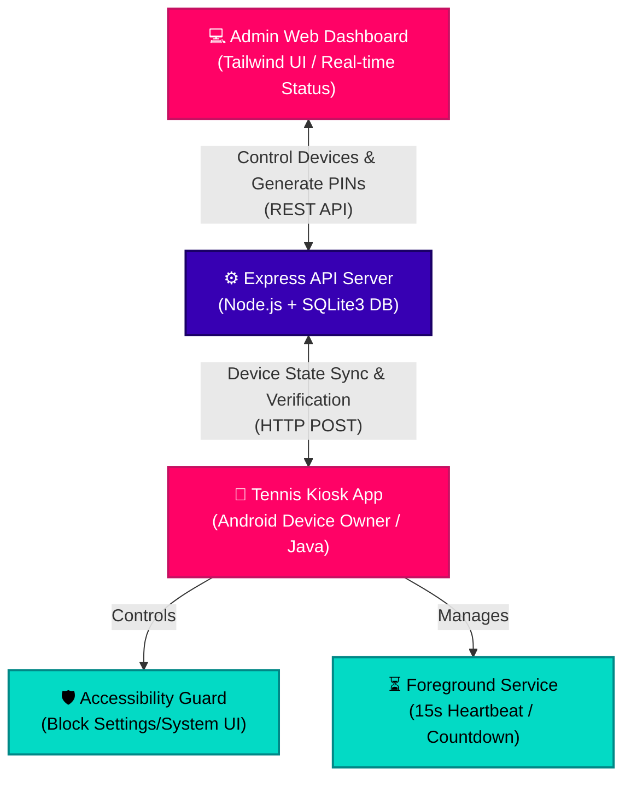
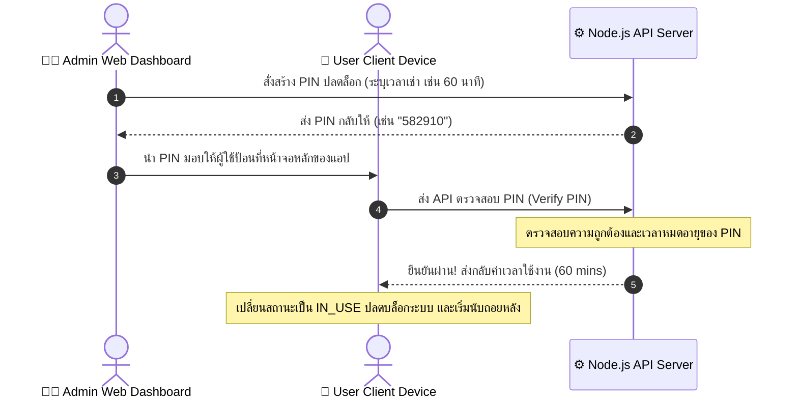
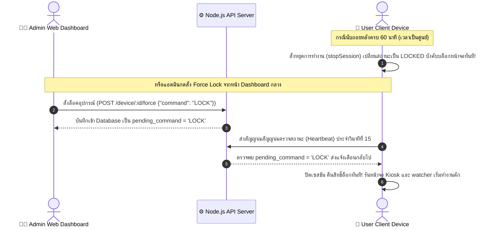

# 🎾 Tennis Lock Kiosk System (ระบบล็อคเครื่องและควบคุมสิทธิ์สำหรับสนามเทนนิส)

ระบบ Kiosk และความปลอดภัยเต็มรูปแบบสำหรับอุปกรณ์พกพา (แท็บเล็ต/มือถือ) ที่ต้องการเปิดให้เช่าใช้งานในสนามเทนนิส โดยหน้าจอจะถูกล็อคและจะสามารถปลดล็อคใช้งานเครื่องได้ด้วยรหัสผ่านแบบชั่วคราว (6-digit PIN) ที่ผู้ดูแลระบบสร้างขึ้นจากเว็บควบคุมกลางผ่านระบบคลาวด์/เซิร์ฟเวอร์ท้องถิ่น

---

## 🏗️ สถาปัตยกรรมระบบ (System Architecture)

ระบบประกอบด้วย 3 ส่วนหลักที่ทำงานประสานกันผ่านเครือข่ายอินเทอร์เน็ต/แลน:



---

## ✨ คุณสมบัติเด่นของระบบ (Key Features)

### 1. Android Kiosk Client (แอปพลิเคชันสำหรับอุปกรณ์)

- **Relentless Launcher Lock (ระบบ Kiosk ป้องกันการออก):** ตั้งค่าตัวเองเป็น Default Launcher (หน้าแรกหลัก) และล็อกหน้าจอ Kiosk ไว้ เมื่อเครื่องเริ่มทำงานจะเปิดแอปขึ้นมาทันที หากผู้ใช้ปัดแอปทิ้งหรือพยายามออกจากแอป ระบบจะทำการเปิดตัวเองขึ้นมาบังหน้าจอใหม่ภายใน **200 มิลลิวินาที (200ms Watcher)**
- **Accessibility Service Guard:** บล็อกการเข้าถึงเมนูการตั้งค่าตัวเครื่อง (`com.android.settings`), หน้าจอลงโปรแกรมภายนอก (`com.android.packageinstaller`), และบล็อกการเลื่อนแถบแจ้งเตือนด้านบน (Notification Shade & Quick Settings) เพื่อป้องกันผู้เช่าแอบปิด Wi-Fi หรือ Bluetooth
- **Persistent Foreground Service:** รันนับเวลาถอยหลังการใช้งานในเบื้องหลังอย่างต่อเนื่อง (Countdown Timer) และจะคอยส่งสัญญาณสถานะเครื่อง (Heartbeat) ไปยังเซิร์ฟเวอร์ทุกๆ **15 วินาที**
- **Device Owner Integration:** รองรับการลงทะเบียนเป็นสิทธิ์สูงสุดของระบบ (Device Owner) เพื่อการล็อกหน้าจอระดับฮาร์ดแวร์อย่างสมบูรณ์แบบ
- **Remote Sync Command:** รองรับการรับคำสั่งด่วนจากเซิร์ฟเวอร์แบบ Real-time เช่น สั่งล็อกเครื่องทันที (Force Lock) หรือสั่งปลดล็อกเครื่องจากระยะไกล (Force Unlock)

### 2. Backend Server & API (ฝั่งระบบหลังบ้าน)

- **Express.js & Node.js Engine:** ประสิทธิภาพสูง เบา สบาย และจัดลำดับการทำงานได้รวดเร็ว
- **SQLite Database Integration:** เก็บข้อมูลอุปกรณ์และรหัสผ่าน PIN ได้โดยไม่ต้องกังวลเรื่องการตั้งค่าฐานข้อมูลให้ยุ่งยาก
- **Auto-Expiration Logic:** ระบบตรวจสอบความถูกต้องและล้างคีย์อัตโนมัติ:
  - รหัส PIN ที่ไม่ได้ใช้งานภายใน **10 นาที** จะถูกปรับเป็นหมดอายุ (`EXPIRED`) อัตโนมัติ เพื่อความปลอดภัย
  - เซสชันที่กำลังใช้งานอยู่ (Active Sessions) จะถูกเช็คและตัดสิทธิ์หมดเวลาโดยอ้างอิงจากเวลาหมดตามจริง

### 3. Web Admin Dashboard (หน้าจอควบคุมสำหรับผู้ดูแล)

- **Modern Interface:** หน้าจอแผงควบคุมสวยงามพรีเมียมด้วยสไตล์ Tailwind CSS ดีไซน์สีเข้ม (Dark Mode) ที่ใช้งานง่ายและสบายตา
- **Real-time Status Tracking:** ตรวจดูสถานะการเชื่อมต่อเครื่องเช่า (ONILNE/OFFLINE/IN_USE/LOCKED) และระดับแบตเตอรี่ในเครื่องของลูกค้าแต่ละเครื่องได้แบบเรียลไทม์
- **PIN Code Generator:** ตั้งเวลาและสร้างรหัสผ่าน 6 หลักเพื่อมอบให้ผู้ใช้บริการนำไปกรอกที่หน้าจอปลดล็อคเครื่อง
- **Remote Force Kill / Exit Kiosk:** ผู้ดูแลระบบสามารถกดปุ่มสั่งล็อกเครื่องของลูกค้าลงทันที หรือเปิดปลดล็อกเครื่องค้างไว้ผ่านหน้าจอหลังบ้านได้ในคลิกเดียว

---

## 📂 โครงสร้างของโปรเจกต์ (Project Directory Structure)

```
Tennis_App/
├── README.md               # เอกสารแนะนำการติดตั้งและสถาปัตยกรรมระบบ
├── .gitignore              # ไฟล์ยกเว้นการอัปโหลด Git ของโครงการ
├── server/                 # เซิร์ฟเวอร์ Backend และ Web Dashboard
│   ├── data/               # โฟลเดอร์จัดเก็บ SQLite Database (SQLite3)
│   ├── public/             # หน้าเว็บ HTML Dashboard (Tailwind CSS)
│   ├── routes/             # เส้นทาง API (admin.js, device.js)
│   ├── index.js            # ไฟล์หลักสำหรับเริ่มต้นรันเซิร์ฟเวอร์ Express
│   ├── database.js         # ส่วนติดตั้งและสร้างตารางฐานข้อมูล SQLite
│   ├── package.json        # ไฟล์ระบุ Module Dependencies
│   ├── Dockerfile          # บิวด์อิมเมจ Docker สำหรับเซิร์ฟเวอร์
│   └── docker-compose.yml  # การตั้งค่า Docker Compose สะดวกรวดเร็ว
└── TennisLockApp/          # ตัวแอปพลิเคชันระบบล็อกบน Android (Java)
    ├── app/src/main/
    │   ├── AndroidManifest.xml  # การประกาศสิทธิ์การทำงาน, บริการ และ Receiver ของระบบ
    │   └── java/com/example/tennislockapp/
    │       ├── MainActivity.java            # หน้าล็อกสกรีนหลักรับรหัส PIN
    │       ├── LockForegroundService.java   # ระบบนับเวลาถอยหลังและส่ง Heartbeat
    │       ├── LockAccessibilityService.java# บริการควบคุมสิทธิ์การบล็อก Settings และ System UI
    │       ├── LockDeviceAdminReceiver.java # รองรับการควบคุมสิทธิ์ Device Admin / Reboot Relaunch
    │       └── MyHttpClient.java            # ตัวจัดการส่งข้อมูล HTTP POST/GET ไปหา API
    └── ...
```

---

## 🚀 วิธีการติดตั้งและรันใช้งาน (Installation & Setup)

### ส่วนที่ 1: การติดตั้งเซิร์ฟเวอร์ Backend (`server`)

คุณสามารถเลือกติดตั้งได้ 2 รูปแบบตามความสะดวกดังนี้:

#### วิธีการที่ A: ติดตั้งและรันผ่าน Docker (แนะนำสำหรับการใช้งานจริง)

เข้าไปที่โฟลเดอร์ `server` แล้วสั่งรันด้วย Docker Compose:

```bash
cd server
docker-compose up -d --build
```

ระบบจะรันขึ้นมาทันทีที่พอร์ต `3000` โดยฐานข้อมูลจะถูกเก็บรักษาไว้ที่โฟลเดอร์ `./data/database.sqlite` ในเครื่องหลักอย่างปลอดภัย

#### วิธีการที่ B: ติดตั้งและรันด้วย Node.js บนเครื่องตรงๆ

1. ตรวจสอบให้แน่ใจว่าเครื่องของคุณมี Node.js ติดตั้งอยู่ (เวอร์ชัน 18 ขึ้นไป)
2. เข้าโฟลเดอร์และลงไลบรารีที่จำเป็น:

```bash
cd server
npm install
```

3. เริ่มต้นรันเซิร์ฟเวอร์:

```bash
node index.js
```

เซิร์ฟเวอร์จะเปิดทำงานที่: [http://localhost:3000](http://localhost:3000)

---

### ส่วนที่ 2: การตั้งค่าแอปพลิเคชัน Android (`TennisLockApp`)

1. **เปิดโครงการใน Android Studio:**
   นำเข้าโฟลเดอร์ `TennisLockApp` เข้าสู่ Android Studio และรอการสร้าง Gradle จนเสร็จสิ้น
2. **การตั้งค่าสิทธิ์สูงสุด (Device Owner - สำคัญมาก):**
   เพื่อให้ฟีเจอร์ Lock Task Mode บล็อกหน้าจอได้อย่างสมบูรณ์ ต้องเปิดสิทธิ์สูงสุดระดับเจ้าของเครื่องให้กับตัวแอป โดยเชื่อมต่อมือถือ/แท็บเล็ตเข้ากับคอมพิวเตอร์ผ่านสาย USB (ต้องเปิด USB Debugging) แล้วรันคำสั่ง ADB นี้ใน Terminal:
   ```bash
   adb shell dpm set-device-owner com.example.tennislockapp/.LockDeviceAdminReceiver
   ```
   > [!IMPORTANT]
   > ก่อนที่จะลงทะเบียนสิทธิ์ Device Owner จะต้องตรวจดูให้แน่ใจว่าอุปกรณ์ Android เครื่องนั้นไม่มีการลงชื่อเข้าใช้บัญชี Google (เช่น Gmail) หรือรหัสผ่านล็อกหน้าจอยังว่างอยู่ มิฉะนั้นคำสั่งอาจจะขึ้นแจ้งเตือนผิดพลาดได้ (สามารถลงชื่อเข้าใช้กลับคืนได้หลังเซ็ตอัพเรียบร้อย)
3. **เปิดใช้งาน Accessibility Service:**
   ไปที่เมนู **Settings (การตั้งค่า) > Accessibility (การช่วยเหลือการเข้าถึง)** บนเครื่องพกพา แล้วกดเปิดใช้งานให้กับ **"Tennis Lock Accessibility Guard"** เพื่อให้แอปพลิเคชันบล็อกหน้าต่าง Settings และการลากแถบแจ้งเตือนด้านบนได้สำเร็จ
4. **ระบุที่อยู่ของเซิร์ฟเวอร์กลาง (Server IP Configuration):**
   - ในการติดตั้งครั้งแรก เปิดแอปพลิเคชัน `TennisLockApp` บนเครื่อง
   - เข้าสู่หน้าแอดมินโดยคลิกที่ปุ่มแอดมินหรือคลิกตามวิธีเข้าที่ระบุในแอป
   - กรอกไอพีแอดเดรสของเซิร์ฟเวอร์ฝั่งผู้ดูแลระบบ เช่น `http://192.168.1.100:3000` เพื่อให้ระบบซิงค์ข้อมูลกับหลังบ้านได้ถูกต้อง

---

## 📡 ข้อมูลทางเทคนิคและ REST API (API Specifications)

### หมวดหมู่อุปกรณ์ (Device Endpoints)

| Method   | Endpoint                 | Description                      | Payload (JSON)                                                        | Response Success                                |
| :------- | :----------------------- | :------------------------------- | :-------------------------------------------------------------------- | :---------------------------------------------- |
| **POST** | `/api/device/register`   | ลงทะเบียนตัวเครื่องเข้าระบบ      | `{"device_id": "unique-id"}`                                          | `{"message": "Device registered successfully"}` |
| **POST** | `/api/device/verify-pin` | ตรวจสอบรหัสปลดล็อกของลูกค้า      | `{"device_id": "unique-id", "pin": "123456"}`                         | `{"message": "...", "duration_minutes": 60}`    |
| **POST** | `/api/device/heartbeat`  | รายงานสถานะเครื่องทุกๆ 15 วินาที | `{"device_id": "unique-id", "battery_level": 85, "status": "IN_USE"}` | `{"message": "...", "pending_command": "LOCK"}` |

### หมวดหมู่แอดมิน (Admin Endpoints)

| Method     | Endpoint                      | Description                          | Payload (JSON)                      | Response Success                               |
| :--------- | :---------------------------- | :----------------------------------- | :---------------------------------- | :--------------------------------------------- |
| **GET**    | `/api/admin/devices`          | เรียกดูประวัติอุปกรณ์และสถานะทั้งหมด | _None_                              | รายการอุปกรณ์ในคลัง `[{"id": 1, ...}]`         |
| **POST**   | `/api/admin/generate-pin`     | สร้างรหัส PIN ใหม่ตามระยะเวลาเช่า    | `{"duration_minutes": 60}`          | `{"message": "...", "pin": "987654"}`          |
| **GET**    | `/api/admin/sessions`         | ตรวจดูประวัติเซสชันและการเช่า        | `?limit=10&offset=0`                | รายชื่อเซสชัน และจำนวนทั้งหมด                  |
| **POST**   | `/api/admin/device/:id/force` | สั่งการอุปกรณ์ด่วนจากระยะไกล         | `{"command": "LOCK"}` หรือ `UNLOCK` | `{"message": "Command queued..."}`             |
| **DELETE** | `/api/admin/devices`          | ล้างรายชื่ออุปกรณ์ที่ลงทะเบียนไว้    | _None_                              | `{"message": "All connected devices cleared"}` |
| **DELETE** | `/api/admin/sessions`         | ล้างประวัติ PIN/เซสชันทั้งหมด        | _None_                              | `{"message": "All sessions cleared"}`          |

---

## 🔄 ลำดับขั้นตอนการทำงาน (Workflow Scenarios)

### Scenario A: เริ่มต้นเช่าและเปิดเครื่องใช้งาน



### Scenario B: เมื่อหมดเวลาเช่า หรือ สั่งล็อกเครื่องจากเซิร์ฟเวอร์



---

## 🛠️ การแก้ไขปัญหาที่อาจพบเจอ (Troubleshooting Guide)

1. **คำสั่งลงทะเบียน Device Owner ขึ้นแจ้งเตือนข้อผิดพลาด:**
   - ให้แน่ใจว่าคุณพิมพ์ชื่อ package และ Receiver ถูกต้องตามตัวอักษร: `com.example.tennislockapp/.LockDeviceAdminReceiver`
   - ให้แน่ใจว่าอุปกรณ์ของคุณไม่พ่วงต่อบัญชีใดๆ อยู่ (Settings > Accounts > ลบบัญชีอีเมลออกทั้งหมดชั่วคราว)
2. **เครื่อง Android แจ้งเตือนส่งสัญญาณไม่ผ่าน (Network Error / Heartbeat Failed):**
   - ตรวจดูการอนุญาตสิทธิ์การเชื่อมต่ออินเทอร์เน็ตในตัวเครื่อง
   - ตรวจเช็คว่าอุปกรณ์ Android และคอมพิวเตอร์เซิร์ฟเวอร์อยู่ในวงแลน (Wi-Fi) เครือข่ายเดียวกันหรือไม่ และเซิร์ฟเวอร์ไม่ได้เปิดไฟร์วอลล์บล็อกพอร์ต `3000` ไว้
3. **ผู้ใช้ปัดแอปออกจากหน้าจอเปิดได้เป็นวินาที:**
   - ตรวจดูว่าได้ตั้งค่าให้ `TennisLockApp` เป็น **Default Launcher (แอปหน้าแรกเริ่มต้น)** ของ Android เครื่องนั้นแล้วหรือยัง หากไม่ได้ตั้งค่าไว้ ระบบการทำงานดักปัดทิ้ง (Relaunch watcher) จะไม่สามารถดึงหน้าจอกลับมาล็อคได้มีประสิทธิภาพสูงสุด
